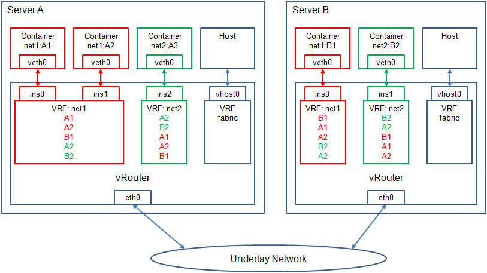

# Docker with OpenContrail
## 1 Overview
OpenContrail is the infrastructure of building and managing overlay virtual networks. It's capable of connecting Docker contrainers across multiple service nodes into one or separate virtual networks, and connecting virtual networks based on defined policies.



### 1.1 vRouter and virtual network
Vrouter is the forwarding engine of OpenContrail. It's located in the host kernel. When a virtual network is created, a VRF is also created and associated to the virtual network. When vRouter receives packets, it determines which VRF packets will be sent to. Then vRouter looks up route in VRF, gets next-hop, and sends packets to it.

### 1.2 Attach container to virtual network
To attach container to virtual network,
* create a tunnel with two veth interfaces (one end in kernel and another end in container),
* attach veth interface in kernel to the VRF of virtual network,
* allocate an IP address to this interface.

DHCP server is provided by vRouter. After attach container to the virtual network, running DHCP client in the container will get the allocated IP address for the veth interface.

A /32 interface route of allocated IP address is also added into the VRF. The next-hop is the veth interface in kernel.

### 1.3 Connect containers in the same virtual network
The interface route in each VRF will be advertised to all VRFs of the same virtual network in other servers. This is done by Contrail control component running BGP. Eventually, each VRF will have all routes of the same virtual network.

### 1.4 Connect virtual networks by network policy
By default, virtual networks are isolated. Routes of containers in one virtual network are not advertised to any other virtual network. To connect virtual networks, network policy has to be defined and attached to virtual networks.

Protocol, port and virtual network can be configured in the network policy to specify what traffic is allowed between which virtual networks.

### 1.5 Flow statistics
OpenContrail is capable of collecting flow statistics and providing REST API interface for users to query. This makes it possible for users to create a feedback loop. By monitoring the traffic, users can check policy enforcement, change container deployment based on traffic load, etc.

### 1.6 External/Public access
Floating IP is supported by OpenContrail to enable external/public access for containers. Gateway is required to support this feature.


## 2 Example
This example is based on OpenContrail 1.06 and Ubuntu 12.04.3.

### 2.1 Installation

#### 2.1.1 OpenContrail
[OpenContrail Installation](opencontrail-install.md)

#### 2.1.2 Docker

```
$ sudo apt-key adv --keyserver keyserver.ubuntu.com --recv-keys 36A1D7869245C8950F966E92D8576A8BA88D21E9
$ echo "deb https://get.docker.io/ubuntu docker main" | sudo tee -a /etc/apt/sources.list.d/docker.list
$ sudo apt-get update
$ sudo apt-get install lxc-docker
```

Download Ubuntu image and check if it works.
```
$ sudo docker run -i -t ubuntu /bin/bash
```

#### 2.1.3 Utility of opencontrail-netns
```
$ git clone https://github.com/pedro-r-marques/opencontrail-netns.git
```
This utility does all configurations to connect vRouter and container.

#### 2.1.4 Utlity of config
```
$ git clone https://github.com/tonyliu0592/opencontrail-config.git
```
This utility does OpenContrail configurations. Update `config` with correct settings.

### 2.2 Connect container to virtual network

#### Create virtual networks
Create two virtual networks, "red" and "green", in tenant "admin". Assume tenant "admin" is already created.
```
$ cd opencontrail-config/opencontrail_config
$ ./config add ipam ipam-default
$ ./config add network red --ipam ipam-default --subnet 192.168.10.0/24
$ ./config add network green --ipam ipam-default --subnet 192.168.20.0/24
```

#### Create containers
Create two containers. Type CTRL-p and CTRL-q to exit container and keep it running.
```
$ sudo docker run -i -t --net="none" ubuntu /bin/bash
$ sudo docker run -i -t --net="none" ubuntu /bin/bash
```

#### Connect container to virtual network
Find out the container ID.
```
$ sudo docker ps
CONTAINER ID        IMAGE               COMMAND             CREATED             STATUS              PORTS               NAMES
dccf1ec5a438        ubuntu:latest       "bash"              38 minutes ago       Up 38 minutes                           naughty_mcclintock
0996f6040d5d        ubuntu:latest       "bash"              38 minutes ago       Up 38 minutes                           sleepy_brown
```

Connect one container to each virtual network respectively.
```
$ sudo mkdir -p /var/run/netns
$ cd ../opencontrail-netns/opencontrail_netns
$ python docker.py -s <API server> -n red --project default-domain:admin --start dccf1ec5a438
$ python docker.py -s <API server> -n green --project default-domain:admin --start 0996f6040d5d
```

Now, two containers are connected to two virtual networks respectively. Policy needs to be created and attached to two virtual networks to allow traffic flow between each other.

#### Connect virtual networks by network policy
Create a policy to pass all traffic and attach to two virtual networks.
```
$ cd ../../opencontrail-config/opencontrail_config
$ ./config add policy policy-default
$ ./config add network red --policy policy-default
$ ./config add network green --policy policy-default
```

Login container and test connection.
```
$ sudo docker attach dccf1ec5a438
root@dccf1ec5a438:/# ip addr show veth0
34: veth0: <BROADCAST,MULTICAST,UP,LOWER_UP> mtu 1500 qdisc pfifo_fast state UP group default qlen 1000
    link/ether 02:1a:74:99:fe:5f brd ff:ff:ff:ff:ff:ff
    inet 192.168.10.253/24 brd 192.168.10.255 scope global veth0
    inet6 fe80::1a:74ff:fe99:fe5f/64 scope link 
       valid_lft forever preferred_lft forever

root@dccf1ec5a438:/# ping 192.168.20.253
PING 192.168.20.253 (192.168.20.253) 56(84) bytes of data.
64 bytes from 192.168.20.253: icmp_seq=1 ttl=64 time=0.774 ms
64 bytes from 192.168.20.253: icmp_seq=2 ttl=64 time=0.066 ms

```


